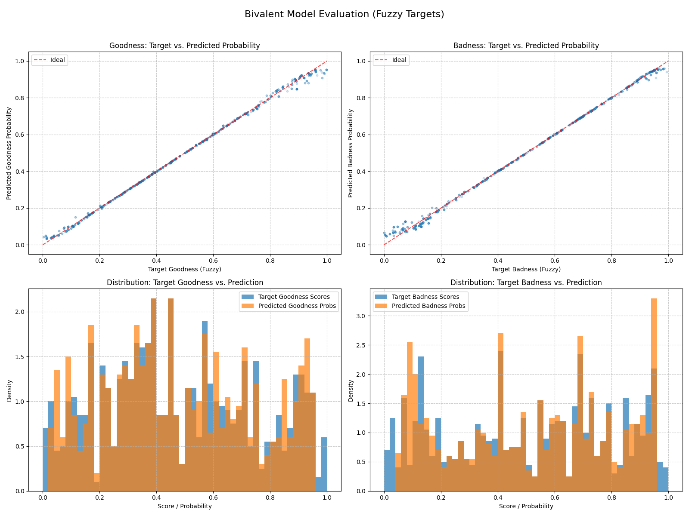

# G/B Demo - Bivalent Fuzzy Logic Model

This directory contains a demonstration of a bivalent learning model capable of predicting independent "goodness" and "badness" scores, which can be fuzzy (continuous values between 0 and 1).

## Overview

The core components are:
- `train.py`: Script to train the bivalent model. It uses a `fixed_kb` (knowledge base) to define targets for a set of `N_ATOMS` unique inputs. This `fixed_kb` is saved alongside the trained model.
- `eval.py`: Script to evaluate a trained model. It loads the model and its corresponding `training_kb.pt` to ensure evaluation is done on the same ground truth the model was trained on. It reports metrics like BCE loss, MSE, MAE, and binarized accuracy, and displays plots visualizing the model's performance on fuzzy targets.
- `data/generator.py`: Generates synthetic data. Each of the `N_ATOMS` (e.g., 300 unique items) is assigned a random fuzzy "goodness" score and a random fuzzy "badness" score. Inputs to the model are one-hot encoded representations of these atoms.
- `models/gb_model.py`: Defines the `GBModel` neural network architecture (a simple MLP outputting two scores) and the `gb_loss` function (sum of BCEWithLogitsLoss for the two output channels).
- `experiments.cfg`: Configuration file for training parameters like learning rate, number of epochs, number of training samples, and loss weights.
- `runs/`: Default directory where trained models, the `training_kb.pt`, and evaluation plots are saved.

## How to Run

1.  **Navigate to this directory:**
    ```bash
    cd path/to/your/project/g_b_demo
    ```
2.  **Set up your Python environment** and install dependencies (e.g., from `requirements.txt` if up-to-date: `pip install torch pyyaml rich matplotlib numpy`).
3.  **Configure `experiments.cfg`** as needed (e.g., `epochs`, `lr`).
4.  **Train the model:**
    ```bash
    python train.py
    ```
    This will save the model and `training_kb.pt` to the directory specified by the `--save` argument (default: `runs/bivalent_demo/`).
5.  **Evaluate the model:**
    ```bash
    python eval.py --model_path path/to/your/runs/your_run_dir/gb_bivalent_model.pth
    ```
    (Or use the default path if you didn't change it during training). This will print metrics and display a 2x2 plot summarizing performance.

## Example Results Plot

The evaluation script (`eval.py`) generates a combined plot showing target vs. predicted probabilities and distributions. An example of such a plot might look like this (assuming `Figure_1.png` is an example of these plots):



*(Make sure `Figure_1.png` is present in this `g_b_demo` directory for the image to display correctly when viewing this README on a platform like GitHub.)*

## Current Task

The model is currently set up to learn a direct mapping from `N_ATOMS` unique one-hot encoded inputs to their corresponding fixed fuzzy bivalent targets. This primarily tests the model's capacity to memorize these mappings. 